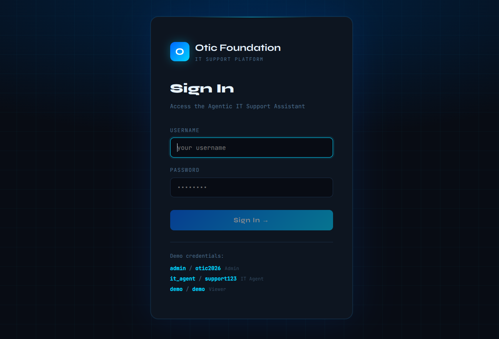
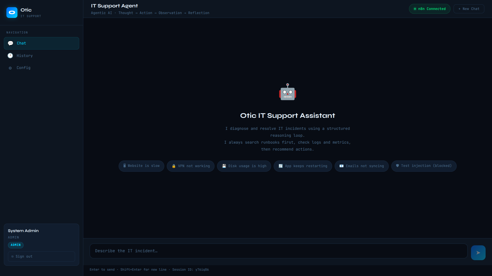
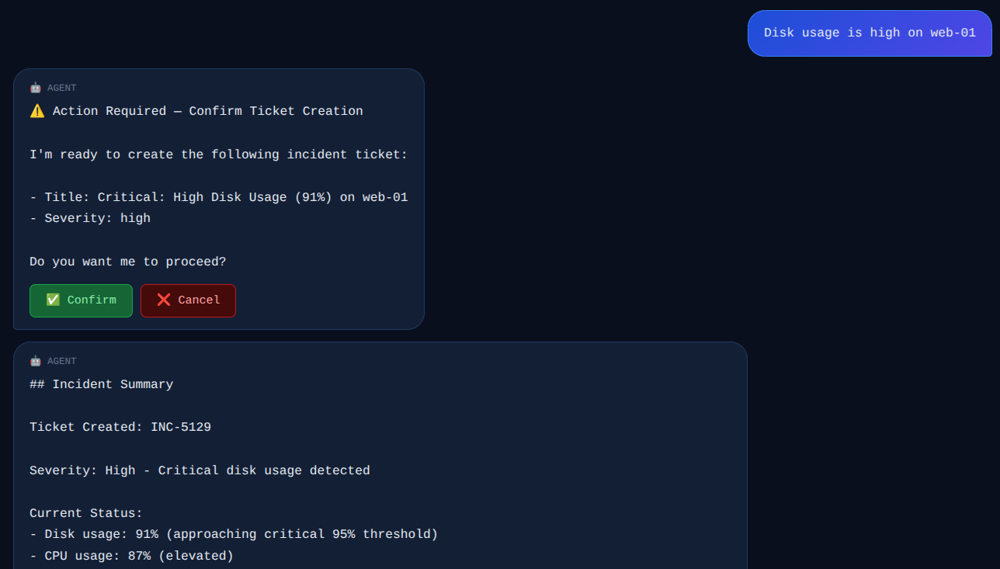
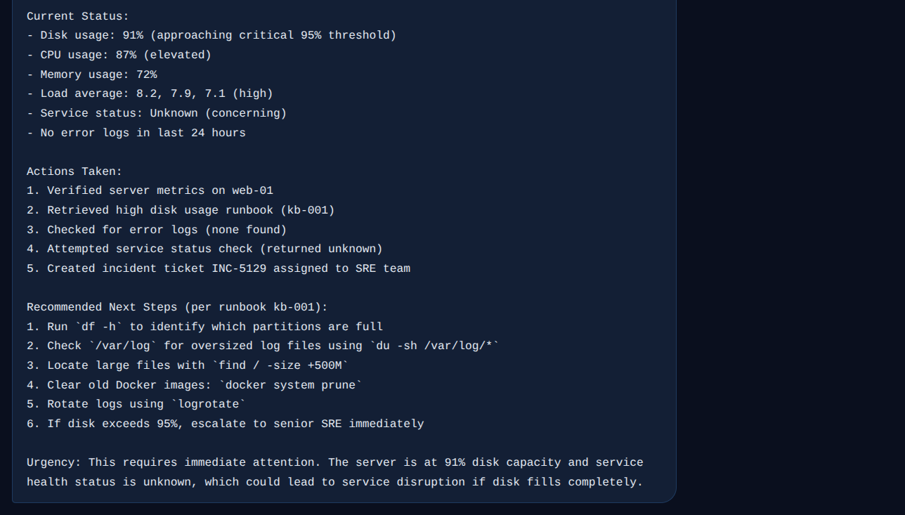
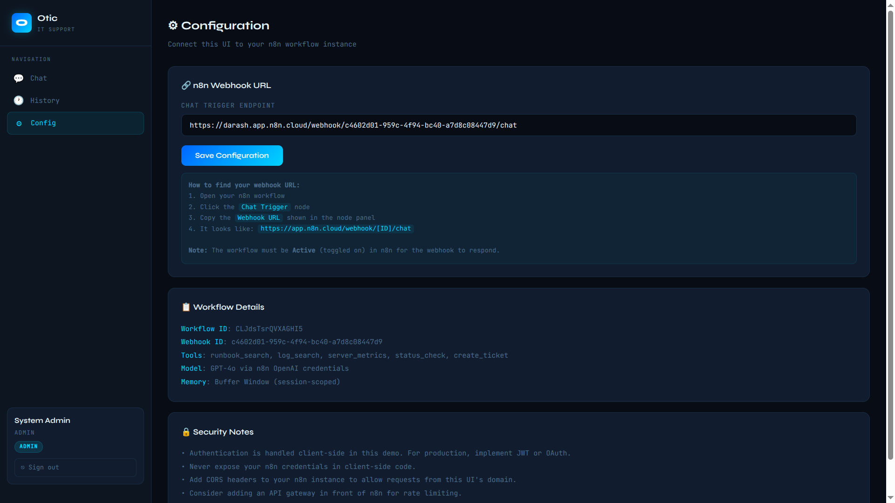
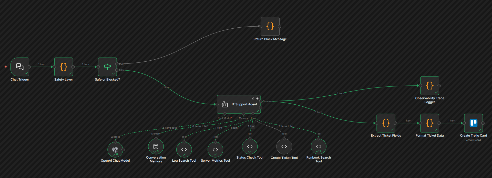
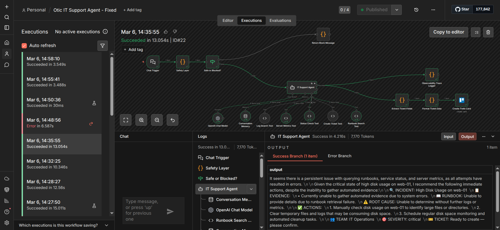
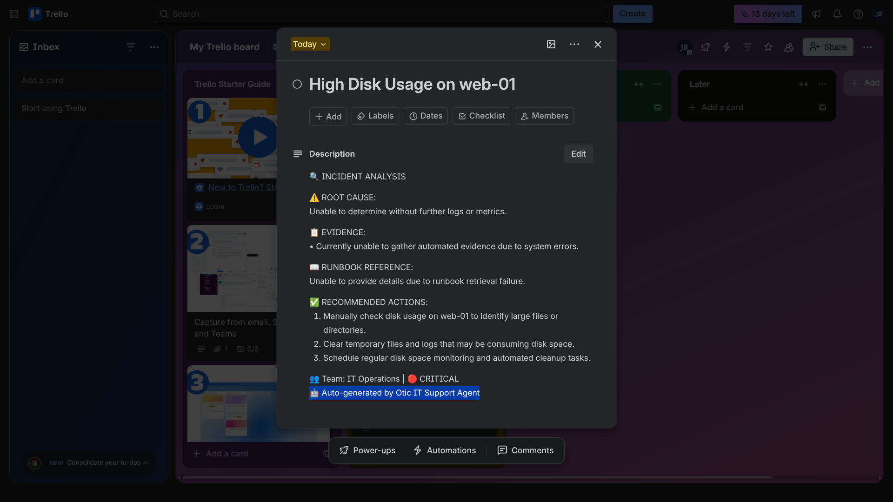

# 🤖 Otic IT Support Agent

> **Agentic AI Internship Practical Assignment** — Otic  
> An Agentic AI IT Support Assistant that diagnoses and resolves IT incidents using a structured multi-step reasoning loop, tool orchestration, RAG grounding, memory, safety guardrails, and full observability.

---

## 📸 Screenshots

### Authentication Screen
> *Login screen with role-based access — Admin, IT Agent, and Viewer roles*



---

### Chat Landing Screen
> *Welcome state with quick-incident shortcuts and agent status indicator*



---

### Chat Sample — Incident Diagnosis
> *Agent diagnosing a high disk usage incident on web-01, reasoning through runbook, metrics, and logs*



---

### Chat Sample — Continuation
> *Agent completing the diagnosis, citing KB-001, and creating a ticket with SLA assignment*



---

### Configuration Screen
> *Webhook URL configuration panel for connecting the UI to the n8n instance*



---

### n8n Workflow — Agent Design
> *Full n8n workflow showing the Safety Layer → Agent → Tools → Observability → Trello pipeline*



---

### n8n Workflow — Backend Execution
> *Live execution trace in n8n showing tool calls, inputs, outputs, and node-by-node results*



---

### Created Trello Card
> *Incident ticket automatically created on the Trello board after agent diagnosis, with severity, SLA, and assigned team*



---

## 🧠 What This System Is

This is **not a chatbot**. It is a true Agentic AI system built around a **Thought → Action → Observation → Reflection** loop. The agent:

1. **Thinks** — classifies the incident and plans which tools to call
2. **Acts** — calls tools iteratively (runbook search first, then logs, metrics, status)
3. **Observes** — reads structured tool outputs as grounded evidence
4. **Reflects** — synthesises a root-cause diagnosis, cites the runbook, and creates a ticket

Every response is grounded in retrieved runbook data. The agent never recommends actions not covered by a known procedure.

---

## 🏗️ Architecture

```
React UI (Vite)
     │
     │  POST /chat  { chatInput, sessionId }
     ▼
Chat Trigger (n8n Webhook)
     │
     ▼
Safety Layer (Code Node)
  ├── 🚫 BLOCKED  ──►  Return Block Message  ──►  User
  └── ✅ SAFE
          │
          ▼
    IT Support Agent  ◄──  GPT-4o (OpenAI)
    (LangChain ReAct)  ◄──  Conversation Memory (Window Buffer)
          │
          ├──◄──  Runbook Search Tool   (RAG · KB-001 – KB-007)
          ├──◄──  Log Search Tool       (Simulated log DB)
          ├──◄──  Server Metrics Tool   (CPU / RAM / Disk)
          ├──◄──  Status Check Tool     (Service health)
          └──◄──  Create Ticket Tool    (INC-XXXX)
          │
          ├──►  Observability Trace Logger
          └──►  Extract Ticket Fields
                     │
                     ▼
               Format Ticket Data
                     │
                     ▼
               Create Trello Card  ──►  Trello Board
```

See [`architecture/OticAgentArchitecture.html`](architecture/OticAgentArchitecture.html) for the full interactive architecture document.

---

## 🛠️ Tech Stack

| Layer | Technology |
|---|---|
| Agent Orchestration | [n8n](https://n8n.io) — LangChain Agent node |
| LLM | OpenAI GPT-4o |
| Memory | n8n Window Buffer Memory (5-turn window) |
| RAG | Embedded keyword search across 7 IT runbooks |
| UI | React + Vite (local dev server) |
| Ticket Tracking | Trello (via n8n Trello node) |
| Safety | Pre-agent Code node — regex injection detection |
| Observability | Post-agent Trace Logger node |

---

## 🔧 Tools

| Tool | Purpose | Key Parameters |
|---|---|---|
| `runbook_search` | RAG — retrieves relevant IT runbook (KB-001–007) | `query` |
| `log_search` | Returns timestamped log entries by service and level | `service`, `level`, `since` |
| `server_metrics` | CPU, memory, disk, uptime, load for a given server | `server` |
| `status_check` | Service state — running/degraded/down, restart count, health | `service`, `server` |
| `create_ticket` | Creates INC-XXXX ticket, triggers Trello card creation | `title`, `severity`, `description`, `assigned_team` |

---

## 🔒 Safety Controls

- **Prompt Injection Detection** — regex patterns on all input *before* the LLM is invoked. Detected patterns include `ignore previous instructions`, `reveal system prompt`, `delete all tickets`, `bypass safety`, and others. Blocked inputs return a canned refusal and are logged.
- **Role-Based Access** — three roles enforced in the UI: Admin, IT Agent, Viewer.
- **Tool Misuse Prevention** — no destructive tools exist. `create_ticket` is only called after a complete evidence-based diagnosis.
- **Credential Protection** — all API keys stored in n8n's encrypted credential vault. No secrets in code or workflow JSON.
- **No Sensitive Data in Memory** — ephemeral window buffer only; no PII or credentials persisted.

---

## 👁️ Observability

The **Observability Trace Logger** node runs in parallel after every agent execution and captures:

- All tool calls with their inputs and outputs
- Reasoning step transitions (Thought → Action → Observation → Reflection)
- Decision points and selected tool at each step
- Final diagnosis summary and ticket reference

This makes the agent's reasoning fully transparent — not a black box.

---

## 🚀 Getting Started

### Prerequisites

- [Node.js](https://nodejs.org/) v18+
- [n8n](https://n8n.io) account (cloud or self-hosted)
- OpenAI API key
- Trello account + API key & token

---

### 1. Clone the Repository

```bash
git clone https://github.com/Joshua-Darash/IT_Support_AI_Agent.git
cd otic-it-support-agent
```

---

### 2. Set Up the n8n Workflow

1. Log into your n8n instance
2. Go to **Workflows → Import**
3. Upload `n8n-workflow/Otic_IT_Support_Agent.json`
4. Open the workflow and configure credentials:
   - **OpenAI node** — add your OpenAI API key
   - **Trello node** — add your Trello API key and token
5. In the **Chat Trigger** node, set **Allowed Origins (CORS)** to `http://localhost:5173` (or `*` for testing)
6. Click **Activate** (toggle top-right) — the workflow must be active for the webhook to respond

> ⚠️ Copy the webhook URL from the Chat Trigger node — you'll need it in step 4.

---

### 3. Set Up the UI

```bash
npm install
```

Create a `.env` file in the root directory:

```bash
cp .env.example .env
```

Edit `.env` and fill in your values:

```env
VITE_N8N_WEBHOOK_URL=https://YOUR-INSTANCE.app.n8n.cloud/webhook/YOUR-WEBHOOK-ID/chat
VITE_ADMIN_PASS=your_admin_password
VITE_AGENT_PASS=your_agent_password
VITE_DEMO_PASS=demo
```

*If the webhook url fails, set its value directly from within the "src/OticITSupportAgent.jsx" code.*

---

### 4. Run the UI

```bash
npm run dev
```

Open [http://localhost:5173](http://localhost:5173) in your browser.

**Demo login credentials** (set in your `.env`):

| Username | Role |
|---|---|
| `admin` | Admin |
| `it_agent` | IT Agent |
| `demo` | Viewer |

---

## 📁 Repository Structure

```
otic-it-support-agent/
├── README.md
├── .env.example                          # Environment variable template
├── .gitignore
│
├── architecture/
│   └── OticAgentArchitecture.html        # Interactive architecture document
│
├── n8n-workflow/
│   └── Otic_IT_Support_Agent.json        # n8n workflow export (import this)
│
│
├── .env.example
├── package.json
├── vite.config.js
└── src/
        ├── assets/                       # Screenshots for this README
        │   ├── auth-screen.png
        │   ├── chat-landing.png
        │   ├── chat-sample.png
        │   ├── chat-sample-continuation.png
        │   ├── config-screen.png
        │   ├── n8n-workflow.png
        │   ├── n8n-execution.png
        │   └── trello-card.
        ├── App.css
        ├── App.jsx
        ├── index.css
        ├── main.jsx
        └── OticITSupportAgent.jsx        # Main React component

```

---

## 🔄 Agent Loop — How It Works

When a user submits an IT incident, the agent executes this loop:

```
User: "Disk usage is critically high on web-01"
        │
        ▼
[THOUGHT]  Incident type: high disk usage. Server: web-01.
           Plan: search runbook → check metrics → check logs → diagnose → ticket.
        │
        ▼
[ACTION]   runbook_search({ query: "disk usage high web server" })
[OBSERVE]  → KB-001 matched: High Disk Usage Resolution.
             Trigger: disk > 90%. Steps: df -h, du -sh, check logs, logrotate.
        │
        ▼
[ACTION]   server_metrics({ server: "web-01" })
[OBSERVE]  → CPU: 87%, Memory: 72%, Disk: 91%, Status: DEGRADED
        │
        ▼
[ACTION]   log_search({ service: "nginx", level: "WARN", since: "6h" })
[OBSERVE]  → [WARN] Disk at 91%, write errors on /var/log partition
        │
        ▼
[REFLECT]  Root cause: /var/log partition full due to unrotated nginx logs.
           Recommendation (per KB-001): run logrotate, clear /tmp, prune docker.
           Severity: HIGH → assigned to IT Operations → SLA: 4 hours
        │
        ▼
[ACTION]   create_ticket({ title: "High Disk Usage web-01", severity: "high", ... })
[OBSERVE]  → INC-7342 created → Trello card published
```

---

## ⚖️ Design Trade-offs & Reflection

**What worked well:**
- n8n's native LangChain agent provided the ReAct loop, keeping implementation effort focused on tool quality and safety logic
- Embedding runbooks directly in Code nodes made the RAG layer portable, fast, and zero-dependency — practical for a demo
- The pre-agent Safety Layer means injection attempts never consume LLM tokens
- Trello integration proves real side-effect actions, distinguishing the system from a chatbot

**Known limitations & production upgrade path:**
- **Simulated tool data** — metrics, logs, and service states are dummy data. Production would call real APIs (Datadog, Splunk, PagerDuty, Prometheus)
- **RAG scaling** — keyword search doesn't handle synonyms. Production upgrade: embed runbooks into a vector store (Pinecone, Weaviate) for semantic similarity
- **Memory persistence** — window buffer resets on n8n restart. Production: persist to Redis or PostgreSQL
- **Authentication** — demo credentials are frontend-only. Production: OAuth / SSO with server-side session validation

---

## 📄 License

This project was built by **JOSHUA BONGO** as part of the **Otic Agentic AI Internship Practical Assignment**.

---

*Built with n8n · OpenAI GPT-4o · React · Vite · Trello*